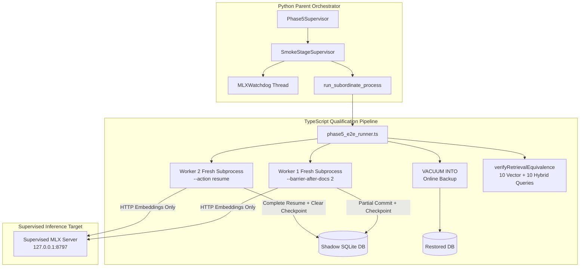

# Phase 5B Fresh-Process Recovery Preparation & Test Mapping Report

**Date**: 2026-09-10  
**Status**: Offline Implementation & Unit Verification Completed (Ready for Parent Real-Run Execution)  
**Authoritative Reference**: `docs/reviews/phase5-parent-mlx-acceptance.md`

---

## 1. Executive Summary

Phase 5A parent acceptance (`docs/reviews/phase5-parent-mlx-acceptance.md`) validated real SDK indexing, vector search, typed hybrid fusion (MRR 1.0), and MCP HTTP probing on temporary shadow databases. However, it explicitly identified two key qualification gaps:
1. **In-process recovery limitation**: Previous recovery qualification occurred within a single Node.js process, rather than testing fresh OS process crash/barrier recovery across process boundaries.
2. **Mislabeled retrieval check**: `restored_retrieval_identical` checked only a single lexical lookup for `"Raft"`, rather than verifying complete ranked vector and hybrid retrieval equivalence across all 10 judged queries before and after `VACUUM INTO`.

Phase 5B closes these gaps by providing:
- **Dedicated TypeScript Recovery Worker** (`scripts/phase5_recovery_worker.ts`): Separate fresh OS subprocess for production `runDurableIndexingJob` execution against isolated shadow SQLite databases, connecting strictly to supervised MLX port 8797 (no fallback, no local GGUF/model loading).
- **Deterministic Two-Worker Lifecycle**: Worker 1 commits partial chunks (2 documents) and halts at a deterministic barrier with an active checkpoint; Worker 2 spawns in a fresh process, opens the database, resumes `runDurableIndexingJob`, and completes all 16 documents with consecutive sequence numbers and zero duplicates.
- **Reusable Bounded Subordinate Process Runner** (`run_subordinate_process` in `scripts/qmd_mlx/supervisor.py`): Replaces blocking `subprocess.run`; enforces monotonic deadline from `ctx.deadline`, periodic `ctx.check_breach()` monitoring, temp-file log capture (avoiding RAM bloat/undrained pipes), and identity-guarded kill+reap of ONLY owned child processes (sentinel processes survive intact).
- **Logical State Invariance on Fingerprint Mismatch**: Compares `content`, `content_vectors`, and `documents` tables before and after rejection of an incompatible checkpoint, proving that rejection leaves database state completely uncorrupted.
- **Full Pre/Post Retrieval Equivalence (`verifyRetrievalEquivalence`)**: Evaluates all 10 held-out evaluation queries in vector and hybrid modes on the recovered database before and after `VACUUM INTO`, asserting identical top-5 ranked document ordering and score tolerances.
- **Fail-Closed Preflight Validation**: Rejects NaN, inf, negative parameters, and conflicting ports before `Popen`, persisting structured failure reports even on preflight failure.

> [!IMPORTANT]
> **Native GPU & Real Model Policy**: In accordance with parent instructions, real models and GPU inference were NOT executed in this preparation pass. The live daemon (PID 1722 on port 8787) was untouched. All verification was conducted strictly offline using unit and fixture test suites. No assertion is made that native recovery has passed; the pipeline is prepared for parent inspection and execution.

---

## 2. Implementation Architecture

### 2.1 Component Overview



### 2.2 Subordinate Process Runner (`scripts/qmd_mlx/supervisor.py`)

- **Function**: `run_subordinate_process(cmd, deadline, check_breach, cwd, env, poll_interval_s, capture_log_prefix, max_log_bytes, barrier_sentinel, kill_on_barrier)`
- **Guarantees**:
  - Non-blocking poll loop checking `time.monotonic() >= deadline`.
  - Periodic invocation of `check_breach()` to detect background watchdog breaches immediately without waiting for child exit.
  - Standard output and error streamed to temporary file on disk (not unbounded in RAM).
  - `finally` block guarantees immediate termination and reaping (`SIGTERM` followed by `SIGKILL` if needed) strictly of the owned PID (`proc.pid`).
  - Sentinel processes and external daemons survive unaffected.

### 2.3 TS Recovery Worker (`scripts/phase5_recovery_worker.ts`)

- **Commands**:
  - `index`: Runs `runDurableIndexingJob` on shadow DB with optional `--barrier-after-docs <N>`. Saves active checkpoint and halts upon reaching barrier.
  - `resume`: Opens existing shadow DB, verifies active checkpoint, resumes `runDurableIndexingJob`, verifies consecutive sequence numbers across all hashes, and clears checkpoint.
- **Safety**:
  - Enforces `validateShadowTarget(dbPath)`.
  - Requires `--launch-token` / `QMD_PHASE5_LAUNCH_TOKEN`.
  - Inline model config points exclusively to `http://127.0.0.1:8797` with `embedBackend: "mlx"` and `mlxFallback: false`.

### 2.4 Pre/Post Retrieval Equivalence (`scripts/phase5_e2e_runner.ts`)

- Evaluates 10 judged queries in `vector` mode and 10 queries in `hybrid` mode (typed queries `{ type: "lex", query: q }` + `{ type: "vec", query: q }`, without query expansion model invocation).
- Backs up recovered database via SQLite `VACUUM INTO`.
- Evaluates identical queries on restored database.
- `verifyRetrievalEquivalence` asserts:
  - Exact `topDocIds` ordering match for every query.
  - Matching `rank1` and `hitAt5` booleans.
  - Identical aggregate IR metrics (`Recall@1`, `Recall@3`, `Recall@5`, `MRR`, `nDCG@5`).

---

## 3. Plan to Test Implementation Mapping

| Requirement / Specification | Implementation Location | Test Location | Test Status |
| :--- | :--- | :--- | :--- |
| **Separate TS Recovery Worker** | `scripts/phase5_recovery_worker.ts` | `test/phase5-recovery.test.ts` (`test_phase5_recovery_worker_launch_token_assertion`) | Passed |
| **Worker 1 Barrier + Worker 2 Resume** | `scripts/phase5_recovery_worker.ts`, `scripts/phase5_e2e_runner.ts` | `test/phase5-recovery.test.ts` (`fresh-process recovery worker executes partial barrier and fresh resumption cycle`) | Passed |
| **Bounded Subordinate Process Runner** | `scripts/qmd_mlx/supervisor.py` (`run_subordinate_process`) | `test/python/test_phase5_qualification.py` (`test_subordinate_process_runner_success`, `test_subordinate_process_runner_timeout`, `test_subordinate_process_runner_breach_detection`) | Passed |
| **Sentinel Survival & Identity Guard** | `scripts/qmd_mlx/supervisor.py` | `test/python/test_phase5_qualification.py` (`test_subordinate_stall_fake_nonmodel_sentinel_survives`) | Passed |
| **Preflight NaN/Inf/Negative Rejection** | `scripts/qmd_mlx/supervisor.py`, `scripts/qmd_mlx/phase5_e2e_qualification.py` | `test/python/test_phase5_qualification.py` (`test_preflight_config_validation_nan_inf_negative`) | Passed |
| **Preflight Failure Report Persistence** | `scripts/qmd_mlx/supervisor.py`, `scripts/qmd_mlx/phase5_e2e_qualification.py` | `test/python/test_phase5_qualification.py` (`test_preflight_failure_report_persisted`) | Passed |
| **Fingerprint Invariance on Rejection** | `scripts/phase5_e2e_runner.ts` | `test/phase5-recovery.test.ts` (`fingerprint mismatch rejection maintains complete logical content and vector state invariance`) | Passed |
| **Full 10-Query Pre/Post Equivalence** | `scripts/phase5_e2e_runner.ts` (`verifyRetrievalEquivalence`) | `test/phase5-recovery.test.ts` (`verifyRetrievalEquivalence passes on identical query details...`, `fails when rankings diverge`) | Passed |
| **Accurate Named Report Checks** | `scripts/qmd_mlx/phase5_e2e_qualification.py`, `scripts/phase5_e2e_runner.ts` | `test/python/test_phase5_qualification.py` | Passed |

---

## 4. Offline Verification Evidence

### 4.1 Python Unit & Supervisor Suite
Command: `PYTHONPATH=. HF_HUB_OFFLINE=1 TRANSFORMERS_OFFLINE=1 .venv/bin/pytest test/python/test_phase5_qualification.py -q`
```text
...............                                                          [100%]
15 passed in 0.95s
```

Full Python Suite: `PYTHONPATH=. HF_HUB_OFFLINE=1 TRANSFORMERS_OFFLINE=1 .venv/bin/pytest test/python/ -q`
```text
................................ss............................ss.ss..s.s [ 27%]
.s..s................................................................... [ 55%]
.........s.............................................................. [ 83%]
...........................................                              [100%]
248 passed, 11 skipped in 32.77s
```

### 4.2 TypeScript Unit & Recovery Suite
Command: `CI=true bun x vitest run test/phase5-recovery.test.ts`
```text
 ✓ test/phase5-recovery.test.ts (9 tests) 985ms
   ✓ Phase 5 Public Fixtures & Recovery Unit Tests > Isolated Shadow Database Recovery Lifecycle > fingerprint mismatch rejection maintains complete logical content and vector state invariance  866ms

 Test Files  1 passed (1)
      Tests  9 passed (9)
```

Resume & Durable Suite: `CI=true bun x vitest run test/indexing-resume.test.ts`
```text
 ✓ test/indexing-resume.test.ts (18 tests) 85ms

 Test Files  1 passed (1)
      Tests  18 passed (18)
```

### 4.3 Build & Git Format Check
- `git diff --check`: Exit code 0 (clean formatting, no whitespace errors).
- `bun run build`: Exit code 0 (`tsc -p tsconfig.build.json` succeeded).

---

## 5. Precise Parent Real-Run Command

When ready to execute the native supervised Phase 5B qualification run with the MLX 4B model, execute:

```bash
PYTHONPATH=. HF_HUB_OFFLINE=1 TRANSFORMERS_OFFLINE=1 \
.venv/bin/python3 scripts/qmd_mlx/phase5_e2e_qualification.py \
  --mlx-port 8797 \
  --mlx-control-port 8798 \
  --timeout-s 120.0 \
  --min-headroom-mb 6000.0 \
  --output-json docs/reviews/artifacts/phase5-isolated-e2e-v5b.json
```

**Expected Real-Run Execution Behavior**:
1. Preflight verifies system headroom >= 6000MB, validates numeric configs, ensures port 8797 and 8798 are available and distinct from production port 8787.
2. `SmokeStageSupervisor` spawns `mlx_embed_server.py` on port 8797 with control port 8798 under `MLXWatchdog` thread supervision.
3. `run_subordinate_process` launches `phase5_e2e_runner.ts` with launch token and deadline bounding.
4. `phase5_e2e_runner.ts` spawns Worker 1 (`phase5_recovery_worker.ts`) to commit 2 documents and stop at barrier.
5. `phase5_e2e_runner.ts` spawns Worker 2 (`phase5_recovery_worker.ts`) in a fresh process to resume indexing to 16 documents.
6. Invariance under synthetic fingerprint mismatch is verified.
7. `VACUUM INTO` creates an online backup, and all 10 evaluation queries are verified for identical ranking and score equivalence pre/post restore.
8. Integrated MCP HTTP transport tool probe (`query` and `get`) runs on ephemeral port.
9. All processes are cleanly reaped, telemetry metrics recorded, and aggregate report saved to `docs/reviews/artifacts/phase5-isolated-e2e-v5b.json`.
